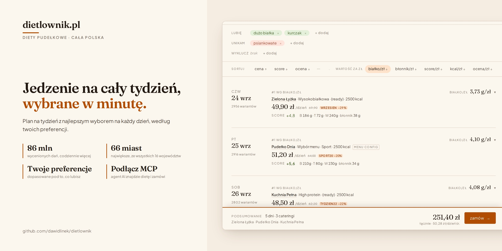

# dietlownik

Pick a week of catering diets in Poland by what you actually want to eat.

dietlownik scrapes every catering that [dietly.pl](https://dietly.pl) lists
in Poland's 66 largest cities into Postgres, reads every meal of every day's menu, and ranks the offers against
preferences written as plain Polish, like _„dużo białka, bez psiankowatych,
kurczak”_. The answer is one pick per day: **which catering, which diet, at
what price after the promo.**

No single catering wins every day, so it never picks one. Each day is priced
and scored on its own, and a week is free to mix three suppliers.

**[dietlownik.b.solvro.pl](https://dietlownik.b.solvro.pl)** · 66 cities —
every voivodeship capital and county-level city — and 177 caterings.

---

## What's in the box

Four components, one repo, one Postgres database.

|                                                                   |                                                                                                                                                                                       |
| ----------------------------------------------------------------- | ------------------------------------------------------------------------------------------------------------------------------------------------------------------------------------- |
| **Scraper** (`scraper/`)                                          | Catalog, prices, menus, promos and diet tags from dietly's mobile API, through a Cloudflare bypass. Each catering once, plus per-city delivery terms and prices. Daily cron at 06:00. |
| **Ranking engine** (`lib/queries.ts`, `lib/preference-router.ts`) | Routes Polish keywords across five channels and scores every meal of every offer. The heart of the project.                                                                           |
| **Dashboard** (`app/`, `components/`)                             | Next.js 16. Set a kcal band and some preferences; get a day-by-day plan with the promo math shown.                                                                                    |
| **MCP server** (`mcp/`)                                           | Seven tools that let an AI agent search, rank, plan a week, quote and fill the user's dietly basket.                                                                                  |

## Quick start

Requires Postgres 16+ with the `vector` and `pg_trgm` extensions, and
[bun](https://bun.sh), which CI, Docker and the git hooks all use.

```bash
bun install
cp .env.example .env          # only DATABASE_URL is required

node db/migrate-fresh.js --seed-taxonomy
bun run scrape:smoke          # one catering, no menus, takes minutes
bun run cities:track          # optional: Poland's 66 county-level cities
bun run scrape                # everything: ~4 h for Wrocław, ~6–7 h for all 66
bun run embed                 # optional: vectors for past-date menus

bun run dev                   # http://localhost:3000
```

## Coverage

dietly addresses every locality by its GUS SIMC code, and caterings deliver
to ~49,000 of them — most by courier, over half served by a single
catering. dietlownik tracks the 66 that matter most: all county-level
cities, 118–153 caterings each, 9,657 catering–city pairs.

What varies by city was measured before building for it
(`bun run check:cities`): catalogs and menus never did (0 of 435 pairs), so
each catering is scraped once. Prices differ for 37 of 177 caterings, so
each city prices from its own advertised price list, and live spot checks
match dietly's quotes city by city (`bun run check:prices`, 220/220). The
whole-country run and its costs are in CLAUDE.md, "City scope".

## Connect an AI agent

The MCP server is mounted inside the app at `/api/mcp` over streamable HTTP.
Point any MCP client at:

```
http://localhost:3000/api/mcp
```

`get_context` · `plan` · `get_offer` · `find_diets` · `quote` · `login` ·
`send_to_basket` — the dashboard's flow as tools: plan day by day, re-price
live, then fill the user's dietly basket. Nothing is ordered or paid from
the MCP; checkout happens on dietly.pl. Each MCP session gets its own dietly
cookie jar, held in memory for 30 idle minutes.
`MCP.md` has the contracts.

## How the ranking works

Every preference keyword is routed by `lib/preference-router.ts`. The first
three channels are exact-match and mutually exclusive; a keyword that matches
none of them goes to the last two:

1. **Allergen**: a synonym lexicon covering the 14 EU allergens
2. **Macro**: grammar like `dużo białka`, `niskie ig`, `mało tłuszczu`
3. **Category**: `ingredient_taxonomy` lookup, expanded to member ingredients
4. **Ingredient**: lexical `word_similarity() >= 0.6` with Polish stemming
5. **Embedding**: semantic match against `multilingual-e5-small` vectors
